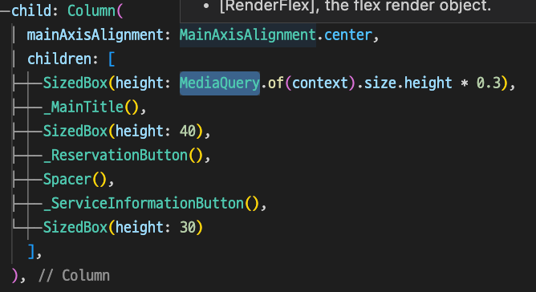

# Week7 Miso&Starbucks 만들기
---
1. 폴더 구조  
    ⁃ 폴더에는 모든 view에서 다 같이 사용하는 요소인 common을 상정할 수 있음  
	⁃ common에는 view와 data가 있음  
	⁃ view에는 IndexedStack 전체를 관할하는 view를 저장할 수 있음  
	⁃ data에는 공통으로 사용하는 색 등을 저장할 수 있음   
	⁃ 사용하는 페이지별로 디렉토리를 나누어 view 정리  

2. 위젯분리  
      
	⁃ 커스텀 위젯을 통해 가독성 향상 가능   

3. 앱 제작 팁  
	⁃ 기기 높이의 %로 줘야 각 기기별로 적절한 위치에 배치할 수 있음.  
	  - ex) SizedBox(height: MediaQuery.of(context).size.height * 0.2),

4. 클래스   
	⁃ MediaQuery
      - 플러터(Flutter)에서 화면 크기를 얻기 위해 MediaQuery라는 클래스를 이용한다. Mediaquery의 경우 화면 크기 외에도 여러 가지 기기의 시스템 정보들을 담고 있다. (텍스트 배율, 24시간 포맷 유무, 기기 방향(orientation) 등등)
