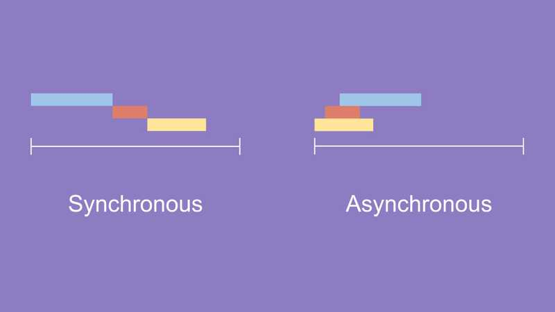

# Week8 
## FloatingActionButton class
* [공식문서링크](https://api.flutter.dev/flutter/material/FloatingActionButton-class.html)  
  

   

* 위와 같이 화면 위에 떠 있으면서 기능을 수행하는 버튼을 말한다.
* 일반적으로 Scaffold.floatingActionButton 필드에서 사용됨.
* stack을 사용하여 버튼을 직접 올리는 것 보다 더욱 효율적인 방법.
* 버튼의 위치 및 색, 크기, 모양, 포함하는 내용 등 다양한 요소를 조절할 수 있다.   

---  

## 동기&비동기

* 데이터를 받는 두 가지 방식
  * 데이터를 요청한 순서대로 받는가 아닌가로 이해하는 것이 좋음.
* 동기(Synchronous)
  * 작업이 동시에 일어난다는 뜻
  * 데이터를 요청했을 때 요청한 순서대로 받아지는 경우
* 비동기(Asynchronous)
  * 작업이 동시에 일어나지 않는다는 뜻
  * 데이터를 요청했을 때 요청한 순서대로 받아지지 않아도 괜찮음.
  * 이전의 요청을 기다리지 않아도 되기 때문에 빠르다는 장점이 있으나 이전에 요청한 데이터를 후에 사용하게 될 경우 문제가 생길 수 있음.

* 동기방식의 예
  * 계좌의 입출금 처리 (입금과 출금의 순서가 잘못될 경우에는 치명적임.)
* 비동기방식의 예
  * cpu의 I/O 요청 (시간이 오래 걸리므로 요청해놓은 후에 다른 작업을 할 수 있음.)